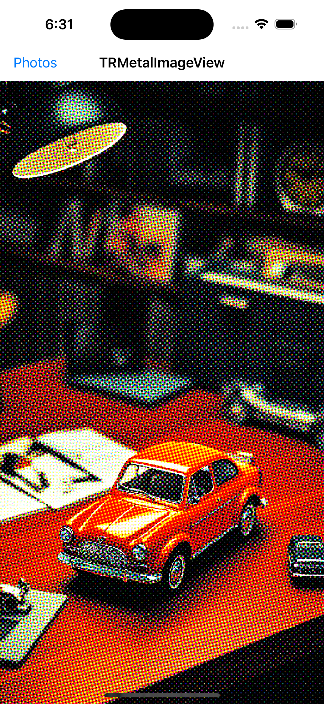

### TRMetalImageView XOJO Plugin

This is project wraps a custom macOS and iOS control, TRMetalImageView, into a cross platform XOJO plugin.

The plugin is complete for macOS and iOS and contains example projects.

### TRMetalImageView

A hybrid macOS and iOS Metal-based control for displaying images. It's like NSImageView or UIImageView, but faster, and handles extremely large images. Can be used synced up with an NSScrollView or UIScrollView.

It works by displaying CIImage images directly to a Metal CALayer on the screen without using an intermediate memory buffer. It’s ideal for live video effects and real-time image processing.

The example XOJO project will load images, convert them to a CIImage, apply a halftone filter, and display them in the window or view.

The example Core Image XOJO projects require the [MBS plugins for XOJO](https://www.mbsplugins.de).