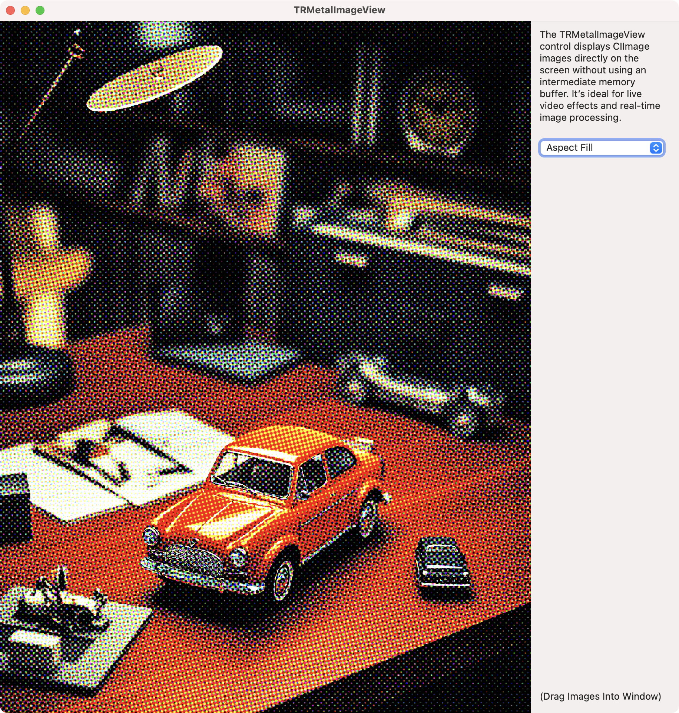

### TRMTKImageView XOJO Plugin

This is project will wrap a hybrid macOS and iOS control, TRMTKImageView, as a XOJO plugin.

The plugin is complete for macOS and contains an example project.

**The next tasks is to create an iOS plugin. There are no clear examples for creating XOJO control plugins for iOS. Help from the XOJO community is greatly appreciated.**

### TRMTKImageView

A hybrid macOS and iOS Metal-based control for displaying images. It's like NSImageView or UIImageView, but faster, and handles extremely large images. Can be used synced up with an NSScrollView or UIScrollView.

It works by displaying CIImage images directly to a Metal CALayer on the screen without using an intermediate memory buffer. It’s ideal for live video effects and real-time image processing.

The example XOJO project will load images, convert them to a CIImage, apply a halftone filter, and display them in the window.

The example XOJO project requires the [MBS plugins for XOJO](https://www.mbsplugins.de).